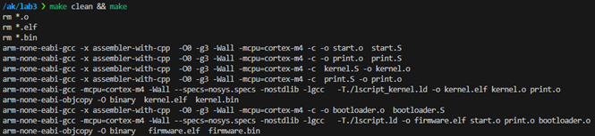
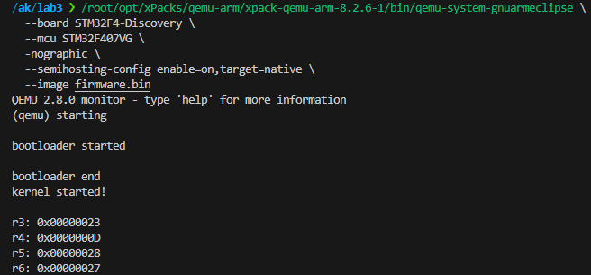

# Архітектура комп’ютерів 3. Мікропроцесорні системи  
## Лабораторна робота №3 (Альтернативна)
### Виконав: Прохоренко Артем Дмитрович, ІО-23  

### Варіант: 5

#### Команди для роботи з пам’яттю: LDRB, STRB

#### Інкремент/Декремент регістру адреси: інкремент

#### Вид зсуву: регістровий

#### Кількість байт для зсуву: 1

### Тема

Завантажувач основної програми. Обробка виключень. Вивід даних на відлагоджувальний порт або консоль.

### Мета

Навчитися працювати з оперативною пам’яттю, використовувати інструкції спеціального призначення, використовувати виключення процесора Cortex-M4. Створення мінімального завантажувача системи. Навчитися користуватися виводом даних через відлагоджувальний порт (або консоль).

### Структура проєкту

- `bootloader.S` — завантажувач, який байтами копіює `kernel.bin` з Flash у RAM з використанням `LDRB`, `STRB` і регістрового зсуву на 1 байт.
- `kernel.S` — ядро, яке містить векторну таблицю, логіку обчислення (функцiя `my_func_5` з [**лабораторної роботи 2**](https://github.com/ADPKPI/ak3_lab2/)) і semihosting-вивід результатів.
- `print.S` — реалізація процедур `dbgput`, `dbgput_line`, `dbgput_num` для semihosting.
- `start.S` — початковий запуск системи, виклик `bootload`.
- `lscript.ld`, `lscript_kernel.ld` — лінкерні скрипти для розміщення bootloader у Flash, а kernel у RAM.
- `Makefile` — автоматизація збірки і запуску.

### Принцип роботи bootloader

1. Виводить у консоль рядок `bootloader started`.
2. Байт за байтом копіює `kernel.bin` у RAM за допомогою `LDRB`, `STRB` і зсуву `r4=1`.
3. Виводить `bootloader end`.
4. Зчитує з RAM адресу `__kernel_reset__` з векторної таблиці (друге слово).
5. Переходить до виконання kernel: `bx r0`.

### Принцип роботи kernel

1. Виводить `kernel started!` через `dbgput_line`.
2. Виконує чотири приклади обчислення `my_func_5(a, b, c)` згідно умов:

- Якщо `P = a * b < 10`: `(P << 2) + (c >> 1)`
- Якщо `10 ≤ P < 20`: `(P >> 1) ^ (b << 1)`
- Якщо `20 ≤ P < 50`: `(a + b + c) * (a & b)`
- Якщо `P ≥ 50`: `factorial(c) + (a | b)`

### Очікувані результати

| a | b | c | P = a*b | Результат | Hex     |
|---|---|---|---------|-----------|---------|
| 2 | 4 | 6 | 8       | 35        | 0x23    |
| 3 | 5 | 2 | 15      | 13        | 0x0D    |
| 5 | 4 | 1 | 20      | 40        | 0x28    |
| 7 | 8 | 4 | 56      | 39        | 0x27    |

### Результати тестування

### Висновок

У данiй лабораторнiй роботi було реалiзовано повноцiнний примiтивний bootloader, який за допомогою команд LDRB, STRB i регiстрового зсуву копiює прошивку ядра з Flash у RAM, та запускає її. Ядро реалiзує функцiю обчислення з умовною логiкою на основi результату множення a*b, виводить промiжнi значення через semihosting. Роботу системи перевiрено у QEMU, значення збiгаються з теоретично очiкуваними.
